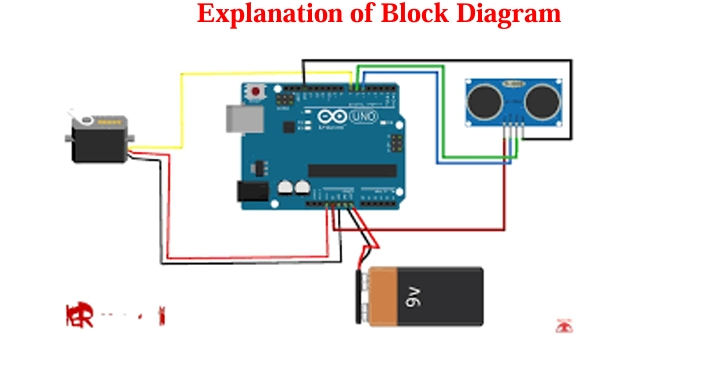
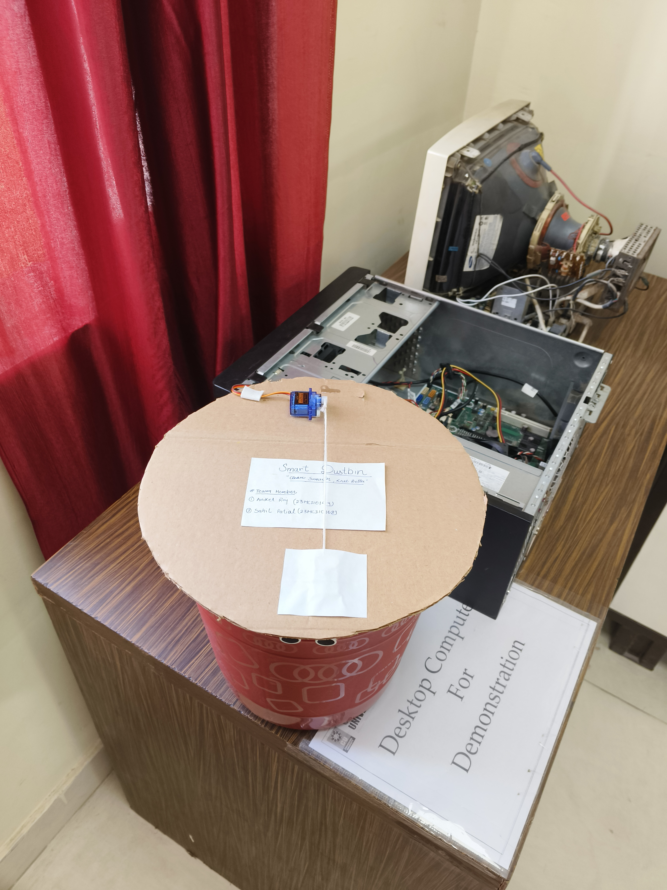
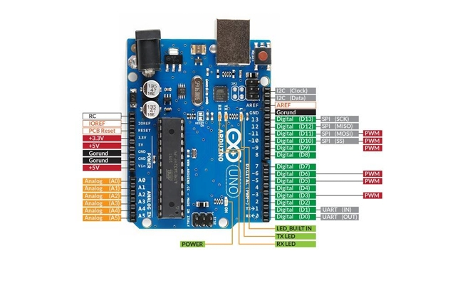

# 🗑️ IoT-Based Smart Dustbin using Arduino Uno


An intelligent, contactless smart dustbin system powered by **Arduino Uno**, **Ultrasonic Sensor**, and **Servo Motor**. This project is designed to promote hygiene by automatically opening the lid when waste is detected.

---

## 👨‍💻 Author Information

- **👤 Name**: Aniket Raj  
- **📘 Branch**: MCA AIML  
- **🎓 UID**: 23MCI10149  
- **📚 Semester**: 4th  
- **📆 Date of Performance**: 21/04/25  
- **📖 Subject**: Internet of Things (23CAH 702)

---

## 📷 Project Images


### 🧱 Block Diagram  


### ✅ Output  


---

## 🧩 Components Used

| S.No | Component             | Quantity |
|------|------------------------|----------|
| 1    | Arduino Uno            | 1        |
| 2    | Ultrasonic Sensor      | 1        |
| 3    | Servo Motor            | 1        |
| 4    | Jumper Wires           | Set      |
| 5    | Breadboard             | 1        |
| 6    | Power Source           | 1        |




---

## ⚙️ Working Principle

The **Ultrasonic Sensor** continuously measures the distance from the lid. When it detects an object (like a hand) within **15 cm**, the **Arduino Uno** signals the **servo motor** to open the lid. After a delay of 3 seconds, the lid automatically closes.

**Features:**
- Contactless lid opening
- Automatic closing
- Low-cost and hygienic

---

## 📜 Project Report

📄 [Download Final Report (PDF)](Project%20Report%20Format%20final%20pdf.pdf)

---

## 💻 Arduino Code

You can find the full source code in [smart_dustbin.ino](smart_dustbin.ino)

```cpp
#include <Servo.h>

#define trigPin 9
#define echoPin 10
#define servoPin 3

Servo myServo;

void setup() {
  pinMode(trigPin, OUTPUT);
  pinMode(echoPin, INPUT);
  myServo.attach(servoPin);
  myServo.write(0);
  Serial.begin(9600);
}

void loop() {
  long duration, distance;

  digitalWrite(trigPin, LOW);
  delayMicroseconds(2);
  digitalWrite(trigPin, HIGH);
  delayMicroseconds(10);
  digitalWrite(trigPin, LOW);

  duration = pulseIn(echoPin, HIGH);
  distance = duration * 0.034 / 2;

  if (distance <= 15) {
    myServo.write(90);
    delay(3000);
    myServo.write(0);
  }

  delay(500);
}
